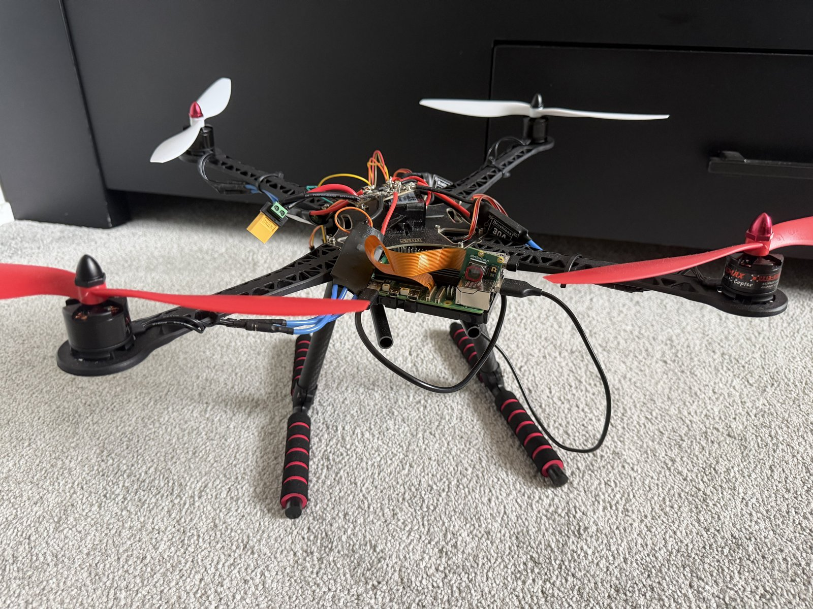
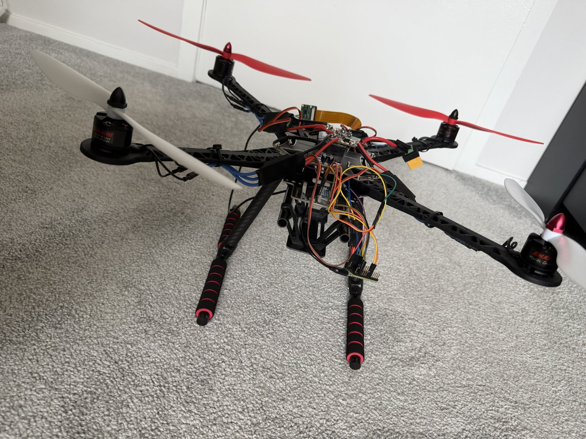
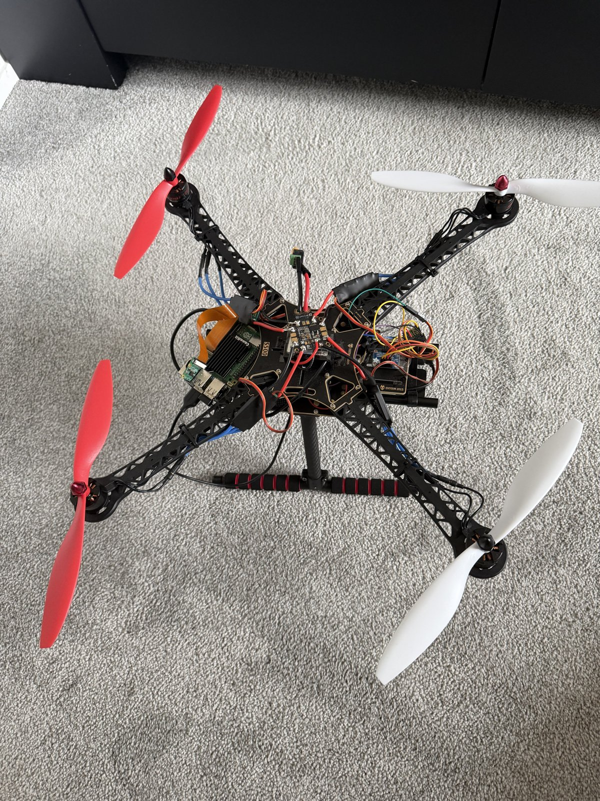

# Autonomous Warehouse Inventory Drone

A quadcopter built from the ground up to fly warehouse aisles and scan barcodes, so inventory counts take minutes instead of a shift with a handheld scanner and a ladder. I wrote the flight controller myself instead of buying one: a Teensy 4.0 running custom embedded C/C++ with a PID loop fed by a BNO055 IMU. A Raspberry Pi 5 on board runs a ROS2 pipeline that detects barcodes from the camera.

Right now flight control and barcode detection are **two separate programs**. I run one or the other, never both at once. Bringing the flight controller into ROS2 so the drone can fly and scan at the same time is the next major step.

  
  
  

---

## Why

Warehouse cycle counts are slow, repetitive and often mean working at height. A drone that flies the aisles and reads the barcodes on shelf labels and pallets can:

- **Speed up inventory.** It scans a whole aisle in one pass instead of a person walking it item by item.
- **Reach high racking** without lifts or ladders.
- **Keep records consistent.** Every scan is logged automatically, and barcodes it has already seen are recognized so they aren't counted twice.

## Components

| Subsystem | Component | Role |
|---|---|---|
| **Frame** | S500 quadcopter frame with carbon landing gear | Airframe, with room on the plates for the Pi, the Teensy and the IMU |
| **Flight controller** | [Teensy 4.0](https://www.pjrc.com/store/teensy40.html) running custom firmware | Runs the PID stabilization loop, drives the ESCs, and receives flight commands from the Pi over USB serial |
| **IMU** | [Adafruit BNO055](https://www.adafruit.com/product/2472) 9-DOF absolute orientation breakout | Supplies roll, pitch and yaw feedback for the PID loop (on-chip sensor fusion) |
| **Companion computer** | Raspberry Pi 5 with a CanaKit heatsink case | Runs either the ROS2 barcode pipeline or the keyboard flight-control program, accessed over SSH |
| **Camera** | Arducam camera module (CSI ribbon) | Captures video frames for barcode detection |
| **Motors** | 4× EMAX MT2213 935KV brushless motors (CW/CCW) | Propulsion |
| **ESCs** | 4× 30A brushless ESCs | Motor speed control, driven by the Teensy |
| **Propellers** | Readytosky 1045 (10×4.5") CW/CCW props | Propulsion, matched to the 935KV motors |
| **Power distribution** | Acxico XT60 power distribution board (3–4S, 5V/12V outputs) | Splits battery power across the ESCs and the electronics |
| **Pi power** | Klnuoxj 12V/24V → 5V 5A USB-C buck converter | Clean 5V supply for the Raspberry Pi 5 |
| **Battery** | 3–4S LiPo (XT60) | Main power |

## System architecture

The drone has two independent programs. Each one runs by itself, and they have never been run at the same time.

### 1. Flight control (Teensy 4.0 + keyboard control over SSH)

**Onboard stabilization:** The BNO055 reports the drone's orientation, and the Teensy runs a PID loop on roll, pitch and yaw. It mixes the corrections into four motor commands and sends them to the ESCs.

**Piloting:** There's no physical RC transmitter. To fly the drone, I SSH into the Raspberry Pi 5 from a laptop and run a keyboard-control program, written with the help of Claude AI. It turns key presses into flight commands and sends them to the Teensy over USB serial, through the Teensy's micro-USB port. This part of the system doesn't use ROS2 yet.

### 2. Barcode detection (Raspberry Pi 5 + ROS2)

The ROS2 pipeline on the Pi reads frames from the Arducam camera and decodes barcodes with `pyzbar`. It stores each barcode it has scanned, so when the camera sees the same one again it knows the barcode has already been logged. At the moment ROS2 covers only the camera and barcode logic. It isn't connected to the flight controller.

## Current status

| Feature | Status |
|---|---|
| Hardware build and wiring (Pi 5, camera, Teensy, IMU, motors) | ✅ Complete |
| Barcode detection with `pyzbar` through the ROS2 pipeline | ✅ Working |
| Barcode memory (recognizes barcodes it has already seen) | ✅ Working |
| Keyboard flight control over SSH (Pi → Teensy via USB serial) | ✅ Working |
| Lift-off and closed-loop attitude hold | ⚠️ Achieves lift, but the PID gains aren't tuned yet, so flight has large oscillations and isn't reliable |
| ROS2 integration for the flight controller | ❌ Not set up yet |
| Running flight and barcode detection at the same time | ❌ Not tested yet |
| Autonomous aisle navigation | ❌ Not working yet |
