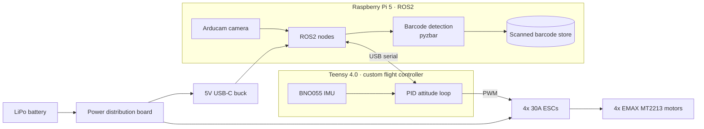

# Autonomous Warehouse Inventory Drone

A quadcopter built from the ground up to fly warehouse aisles and scan barcodes, so inventory counts take minutes instead of a shift with a handheld scanner and a ladder. I wrote the flight controller myself instead of buying one: a Teensy 4.0 running custom embedded C/C++ with a PID loop fed by a BNO055 IMU. A ROS2 pipeline on a Raspberry Pi 5 ties the camera, the barcode detection and the flight controller together.

  
  
  

---

## Why

Warehouse cycle counts are slow, repetitive and often mean working at height. A drone that flies the aisles and reads the barcodes on shelf labels and pallets can:

- **Speed up inventory.** It scans a whole aisle in one pass instead of a person walking it item by item.
- **Reach high racking** without lifts or ladders.
- **Keep records consistent.** Every scan is logged automatically, and barcodes it has already seen are recognized so they aren't counted twice.

## Components

| Subsystem | Component | Role |
|---|---|---|
| **Frame** | S500 quadcopter frame with carbon landing gear | Airframe, with room on the plates for the Pi, the Teensy and the IMU |
| **Flight controller** | [Teensy 4.0](https://www.pjrc.com/store/teensy40.html) running custom firmware | Runs the PID stabilization loop, drives the ESCs, and talks to the Pi over USB serial |
| **IMU** | [Adafruit BNO055](https://www.adafruit.com/product/2472) 9-DOF absolute orientation breakout | Supplies roll, pitch and yaw feedback for the PID loop (on-chip sensor fusion) |
| **Companion computer** | Raspberry Pi 5 with a CanaKit heatsink case | Runs the ROS2 nodes, handles the camera and decodes barcodes |
| **Camera** | Arducam camera module (CSI ribbon) | Captures video frames for barcode detection |
| **Motors** | 4× EMAX MT2213 935KV brushless motors (CW/CCW) | Propulsion |
| **ESCs** | 4× 30A brushless ESCs | Motor speed control, driven by the Teensy |
| **Propellers** | Readytosky 1045 (10×4.5") CW/CCW props | Propulsion, matched to the 935KV motors |
| **Power distribution** | Acxico XT60 power distribution board (3–4S, 5V/12V outputs) | Splits battery power across the ESCs and the electronics |
| **Pi power** | Klnuoxj 12V/24V → 5V 5A USB-C buck converter | Clean 5V supply for the Raspberry Pi 5 |
| **Battery** | 3–4S LiPo (XT60) | Main power |

## System architecture

**Flight control (Teensy 4.0):** The BNO055 reports the drone's orientation, and the Teensy runs a PID loop on roll, pitch and yaw. It mixes the corrections into four motor commands and sends them to the ESCs.

**Perception and inventory (Raspberry Pi 5 + ROS2):** The Pi reads frames from the Arducam camera and decodes barcodes with `pyzbar`. It stores each barcode it has scanned, so when the drone passes the same one again it knows the barcode has already been logged. ROS2 is the layer that links the camera, the barcode logic and the flight controller. The Pi talks to the Teensy over USB serial, using the Teensy's micro-USB port.

## Current status

| Feature | Status |
|---|---|
| Hardware build and wiring (Pi 5, camera, Teensy, IMU, motors) | ✅ Complete |
| Barcode detection with `pyzbar` through the ROS2 pipeline | ✅ Working |
| Barcode memory (recognizes barcodes it has already seen) | ✅ Working |
| Lift-off and closed-loop attitude hold | ⚠️ Achieves lift, but the PID gains aren't tuned yet, so flight has large oscillations and isn't reliable |
| Autonomous aisle navigation | 🚧 Not working yet |

## Roadmap

- [ ] Tune the PID gains on a test stand, one axis at a time, to remove the oscillations
- [ ] Add flight data logging (IMU readings and motor outputs) to help with tuning
- [ ] Autonomous navigation along warehouse aisles
- [ ] Export the scanned barcodes to an inventory system (CSV or a database)

## Lessons learned

Nothing on this drone is abstracted away. There's no off-the-shelf flight controller and no pre-tuned firmware, so when it oscillated on the bench, the cause could be anywhere from my control gains to a marginal ground connection. I had to understand the whole system well enough to tell which. If it didn't fly, it was something I wrote or something I soldered.

The first time it held attitude on its own is still the best moment I've had in engineering.

## Author

**Aryan Jain**: Robotics, embedded systems and controls · [GitHub](https://github.com/aryanjain200425) · [LinkedIn](https://linkedin.com/in/aryan-jain825)
